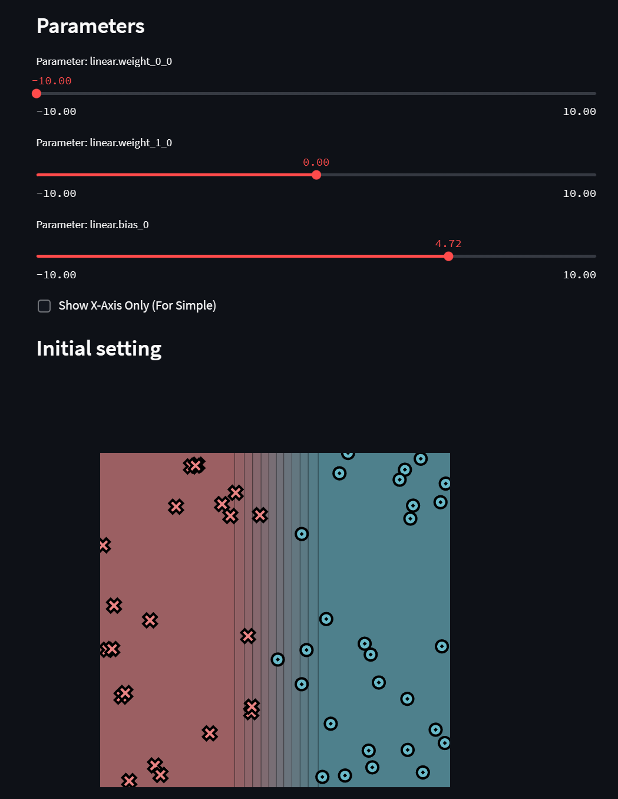

# MiniTorch Module 0


* Docs: https://minitorch.github.io/

* Overview: https://minitorch.github.io/module0.html



```bash
(minitorch) kunzh@kunzh-M15:minitorch/minitorch-module-0$ pytest -vs
========================== test session starts ==========================
platform linux -- Python 3.10.12, pytest-7.1.2, pluggy-1.2.0 -- minitorch/bin/python
cachedir: .pytest_cache
hypothesis profile 'default' -> database=DirectoryBasedExampleDatabase('minitorch/minitorch-module-0/.hypothesis/examples')
rootdir: minitorch/minitorch-module-0, configfile: setup.cfg
plugins: env-0.6.2, hypothesis-6.54.0
collected 44 items                                                      

tests/test_module.py::test_stacked_demo ModuleA1(
  (a): ModuleA2()
  (b): ModuleA3(
    (c): ModuleA4()
  )
)
PASSED
tests/test_module.py::test_module PASSED
tests/test_module.py::test_stacked_module PASSED
tests/test_module.py::test_module_fail_forward XFAIL
tests/test_module.py::test_module_forward PASSED
tests/test_module.py::test_parameter <tests.test_module.MockParam object at 0x7fd454d39270>
PASSED
tests/test_operators.py::test_same_as_python PASSED
tests/test_operators.py::test_relu PASSED
tests/test_operators.py::test_relu_back PASSED
tests/test_operators.py::test_id PASSED
tests/test_operators.py::test_lt PASSED
tests/test_operators.py::test_max PASSED
tests/test_operators.py::test_eq PASSED
tests/test_operators.py::test_sigmoid PASSED
tests/test_operators.py::test_transitive PASSED
tests/test_operators.py::test_symmetric PASSED
tests/test_operators.py::test_distribute PASSED
tests/test_operators.py::test_other PASSED
tests/test_operators.py::test_zip_with PASSED
tests/test_operators.py::test_sum_distribute PASSED
tests/test_operators.py::test_sum PASSED
tests/test_operators.py::test_prod PASSED
tests/test_operators.py::test_negList PASSED
tests/test_operators.py::test_one_args[fn0] PASSED
tests/test_operators.py::test_one_args[fn1] PASSED
tests/test_operators.py::test_one_args[fn2] PASSED
tests/test_operators.py::test_one_args[fn3] PASSED
tests/test_operators.py::test_one_args[fn4] PASSED
tests/test_operators.py::test_one_args[fn5] PASSED
tests/test_operators.py::test_one_args[fn6] PASSED
tests/test_operators.py::test_one_args[fn7] PASSED
tests/test_operators.py::test_one_args[fn8] PASSED
tests/test_operators.py::test_one_args[fn9] PASSED
tests/test_operators.py::test_one_args[fn10] PASSED
tests/test_operators.py::test_one_args[fn11] PASSED
tests/test_operators.py::test_one_args[fn12] PASSED
tests/test_operators.py::test_one_args[fn13] PASSED
tests/test_operators.py::test_two_args[fn0] PASSED
tests/test_operators.py::test_two_args[fn1] PASSED
tests/test_operators.py::test_two_args[fn2] PASSED
tests/test_operators.py::test_two_args[fn3] PASSED
tests/test_operators.py::test_two_args[fn4] PASSED
tests/test_operators.py::test_two_args[fn5] PASSED
tests/test_operators.py::test_backs PASSED

===================== 43 passed, 1 xfailed in 5.38s =====================
```